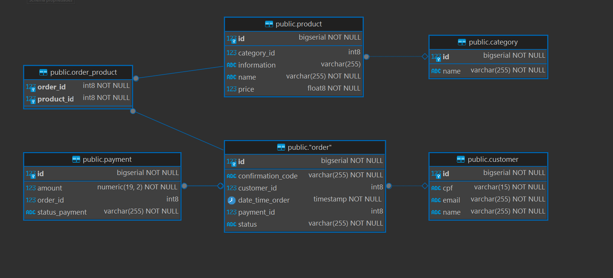

# fiap-food-db

## 1. public.cliente (Tabela de Cliente):

* id: Chave primária, um número inteiro ou sequencial, identificando exclusivamente cada cliente.
* cpf: Cadastro de Pessoa Física (CPF) do cliente.
* nome: Nome completo do cliente.
* email_cliente: Endereço de e-mail do cliente.

## 2. public.produto (Tabela de Produto):

* id: Chave primária, um número inteiro ou sequencial, identificando exclusivamente cada produto.
* nome: Nome do produto.
* descricao: Descrição do produto.
* preco: Preço do produto.

## 3. public.pedido (Tabela de Pedido):

* id: Chave primária, um número inteiro ou sequencial, identificando exclusivamente cada pedido.
* id_cliente: Chave estrangeira que referencia o id na tabela public.cliente, indicando o cliente que fez o pedido.
* data_hora_pedido: Timestamp indicando a data e hora em que o pedido foi realizado.
* status_pedido: Status do pedido (por exemplo, "pendente", "processando", "enviado", "concluído").

## 4. public_item_pedido (Tabela de Item do Pedido):

* id: Chave primária, um número inteiro ou sequencial, identificando exclusivamente cada item do pedido.
* id_pedido: Chave estrangeira que referencia o id na tabela public.pedido, indicando o pedido ao qual o item pertence.
* id_produto: Chave estrangeira que referencia o id na tabela public.produto, indicando o produto incluído no pedido.
* quantidade: Quantidade do produto pedida.

## Relacionamentos:

* Um public.cliente pode ter vários public.pedidos.
* Um public.pedido pode ter vários public_item_pedidos.
* Um public.produto pode ser incluído em vários public_item_pedidos (pertencentes a pedidos diferentes).